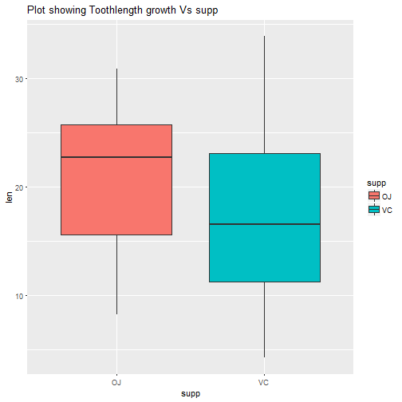
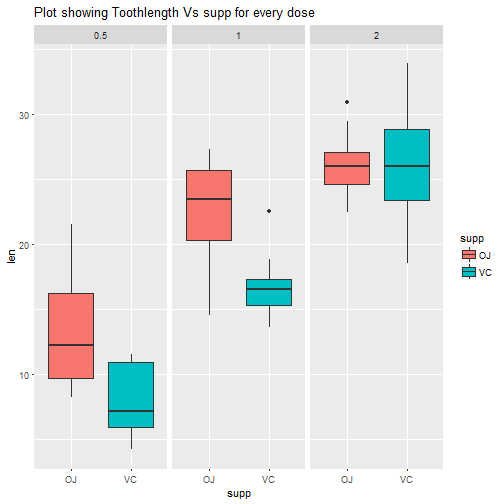

Presentation on Toothlength growth analysis
========================================================
author: RP
date: 20-06-2017
autosize: true

Overview
========================================================

In this app, we analyse Toothlength growth with respect to dosage and type of supplement provided.

For this, we print regression statistics and plot mean length of Toothgrowth (calculated) against the following options given by user

-1. Dosage of supplement

-2. Supplement type

-3. Dosage for every supplement type

Resources- App,Code  
========================================================

-For Shiny app, Please refer to the following shinyapps link 
https://rpri.shinyapps.io/Toothanalysis/
(please open in googlechrome browser for best view)

For Shiny app's code (UI.R and Server.R), Please refer to the github link
https://github.com/rpri/developingdataproducts

Slide With Regression statistics
========================================================
Depending on user's choice ,Regression statistics are displayed
For eg, Following is Regression of Toothlength growth Vs Supplement type

```r
fit2<-lm(ToothGrowth$len ~ ToothGrowth$supp)
      summary(fit2)
```

```

Call:
lm(formula = ToothGrowth$len ~ ToothGrowth$supp)

Residuals:
     Min       1Q   Median       3Q      Max 
-12.7633  -5.7633   0.4367   5.5867  16.9367 

Coefficients:
                   Estimate Std. Error t value Pr(>|t|)    
(Intercept)          20.663      1.366  15.127   <2e-16 ***
ToothGrowth$suppVC   -3.700      1.932  -1.915   0.0604 .  
---
Signif. codes:  0 '***' 0.001 '**' 0.01 '*' 0.05 '.' 0.1 ' ' 1

Residual standard error: 7.482 on 58 degrees of freedom
Multiple R-squared:  0.05948,	Adjusted R-squared:  0.04327 
F-statistic: 3.668 on 1 and 58 DF,  p-value: 0.06039
```

Slide With Plot of Tooth length growth Vs Supplement type
========================================================



Slide With Plot of Toothlength growth Vs Supp and dosage
========================================================



Thank you
========================================================
